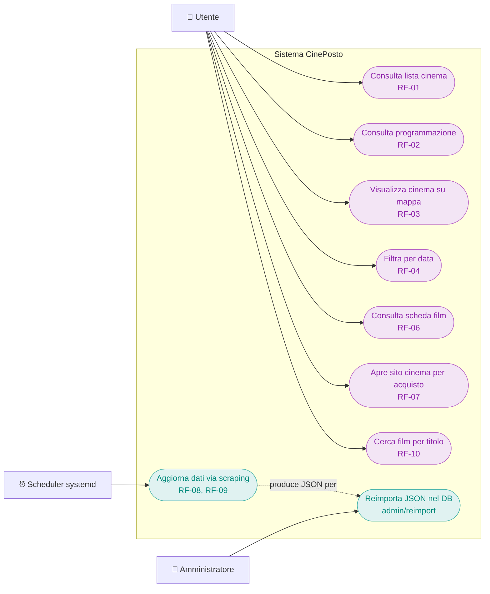
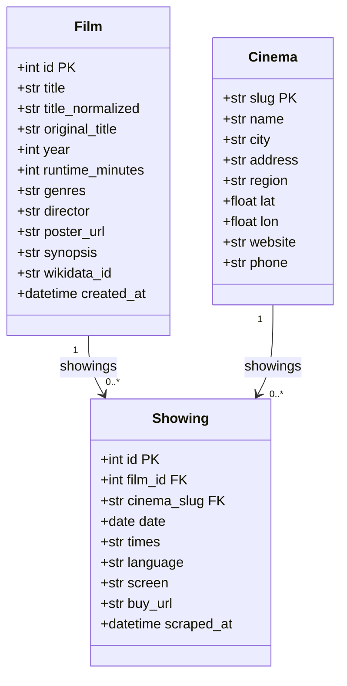
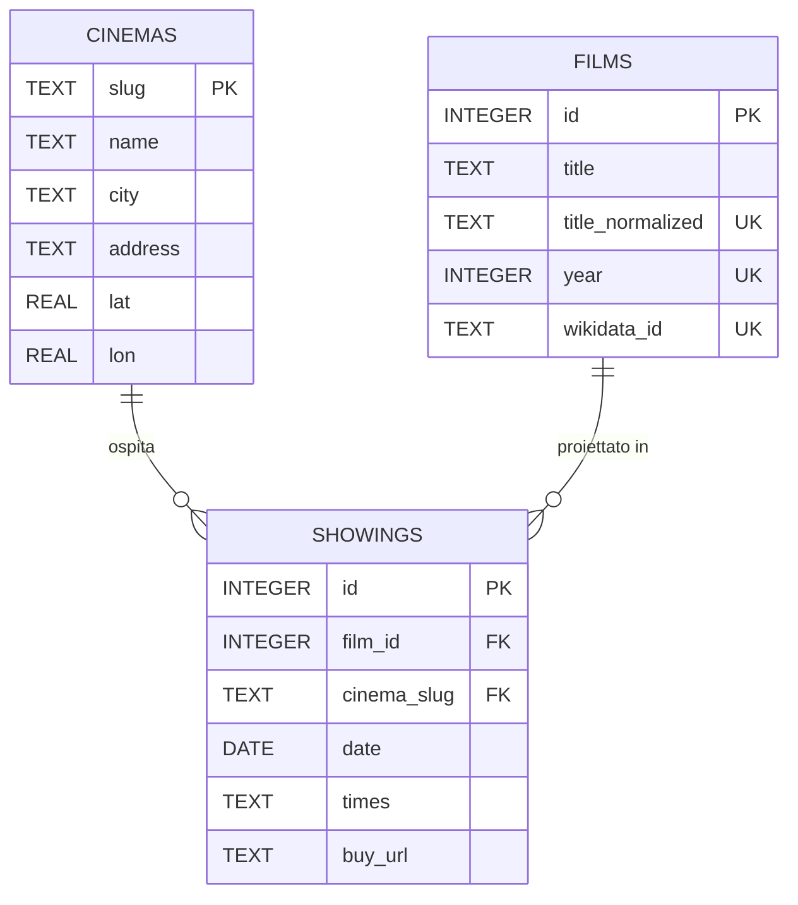
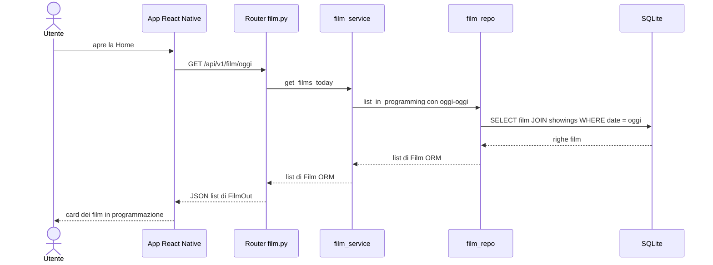
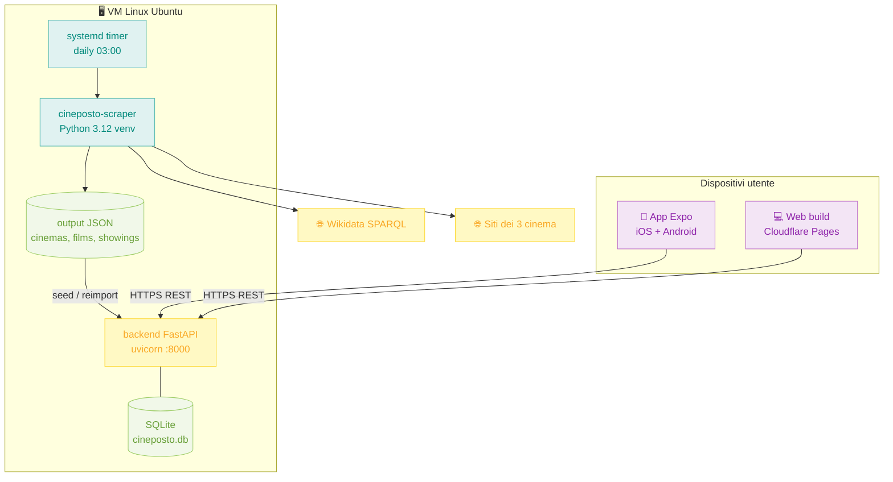

---
aliases:
  - CinePosto — Progettazione UML e Design Pattern
linter-yaml-title-alias: CinePosto — Progettazione UML e Design Pattern
---

# CinePosto — Progettazione UML e Design Pattern

| **Progetto**   | CinePosto                                                          |
| -------------- | ------------------------------------------------------------------ |
| **Team**       | RepCode                                                            |
| **Componenti** | Emanuele Ceccariglia, Elio Casciola, Andrea Cestelli, Yonas Burka  |
| **Corso**      | Ingegneria del Software — ITS Umbria Academy, a.a. 2025/2026       |

Modelli UML del sistema, derivati dai requisiti ([analisi-requisiti](analisi-requisiti.md)) e dal codice implementato. Riferimenti: Sommerville cap. 5 (modellazione), cap. 6 (architettura).

---

## 1. Use case diagram

Attori: **Utente** (nessuna registrazione richiesta, RNF-03) e **Amministratore** (team, via token). Lo **Scheduler systemd** è un attore di sistema che avvia lo scraping senza intervento umano.

RF-05 (filtro zona) e RF-11 (avviso dati obsoleti) sono rimandati a Release 1.1 — vedi [sprint-plan](sprint-plan.md).

## 2. Class diagram — modello di dominio backend

Le tre entità SQLAlchemy in `backend/app/models/`. `Showing` è la classe associativa tra `Film` e `Cinema`, con gli orari del giorno serializzati in `times`.

Vincoli di unicità (dedup): `Film` → `UNIQUE su title_normalized + year`; `Showing` → `UNIQUE su film_id + cinema_slug + date`. Motivazione della PK artificiale di Film in [schema-mapping](../backend/schema-mapping.md).

## 3. Diagramma ER — schema database

DB: SQLite anche in produzione — decisione D4. Le FK sono attivate esplicitamente con `PRAGMA foreign_keys=ON` a ogni connessione, perché SQLite di default le ignora.

## 4. Sequence diagram — caso d'uso "Film oggi"

Flusso completo della schermata Home attraverso i layer del backend.

## 5. Deployment diagram

## 6. Design pattern adottati

Pattern effettivamente presenti nel codice, con posizione.

| Pattern | Dove | Perché |
|---|---|---|
| **Layered architecture** — Sommerville §6.3 | `routers/ → services/ → repositories/ → models/` | Ogni layer ha una responsabilità sola; si testa e si sostituisce in isolamento |
| **Repository** — Fowler PoEAA | `backend/app/repositories/` | Le query SQL vivono in un punto solo; i service non conoscono SQLAlchemy |
| **Service layer** — Fowler PoEAA | `backend/app/services/` | Logica di business separata da HTTP e da persistenza |
| **DTO** | `backend/app/schemas/` — Pydantic | Il contratto API è esplicito e disaccoppiato dal modello DB |
| **Dependency Injection** | `Depends(get_db)` nei router | La session DB è iniettata: nei test si sostituisce con il DB in-memory |
| **Factory** | `create_app()` in `main.py` | L'app FastAPI è costruita da una funzione: configurabile e testabile |
| **Strategy** — GoF | `scraper/connectors/base.py` ABC + 3 connettori concreti | Ogni cinema è una strategia intercambiabile con la stessa interfaccia `scrape`; aggiungere un cinema = aggiungere un file |
| **Upsert idempotente** | `seed_from_json.py` + repository `upsert` | Il seed può girare N volte con lo stesso risultato: nessun duplicato |
