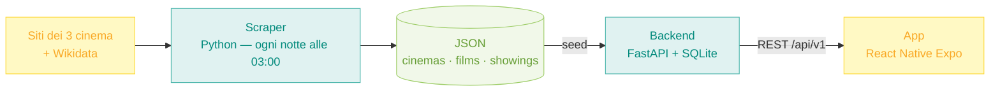

# CinePosto — Panoramica del sistema

> **Il documento da leggere per capire il progetto da cima a fondo.** Spiega cosa fa ogni componente, come si parlano e perché sono stati fatti così. Per il dettaglio di ogni parte, i link alle aree tecniche sono in fondo a ogni sezione.

**Cos'è**: aggregatore della programmazione dei cinema dell'Umbria. L'utente apre l'app e vede in un posto solo cosa danno stasera in 3 cinema (PostModernissimo, The Space Corciano, UCI Perugia), con orari, scheda film e link per comprare il biglietto. Nessuna registrazione.

---

## 1. Il flusso dei dati, end-to-end

Il sistema è una **pipeline in 3 stadi**: raccolta → esposizione → consumo. Ogni stadio è un componente indipendente, collegato al successivo da un contratto esplicito (file JSON tra scraper e backend, API REST tra backend e app).



**Una notte tipo**: alle 03:00 il timer systemd sveglia lo scraper → i 3 connettori raccolgono la programmazione dei prossimi 8 giorni → i titoli vengono normalizzati e deduplicati → Wikidata arricchisce ogni film (poster, regista, anno, sinossi) → escono 3 JSON "DB-ready" → il backend li importa nel DB SQLite (seed idempotente) → da quel momento l'app riceve dati freschi dall'API.

## 2. Stadio 1 — Scraper (`scraper/`)

**Compito**: trasformare 3 siti web eterogenei in dati strutturati uniformi.

Ogni cinema ha il suo **connettore** (pattern Strategy: stessa interfaccia `scrape()`, implementazione diversa):

| Connettore | Fonte | Tecnica |
|---|---|---|
| PostModernissimo | sito Next.js | parsing del payload RSC + HTML (BeautifulSoup/lxml) |
| The Space Corciano | API REST OAuth2 | chiamate API, con fallback CloakBrowser |
| UCI Perugia | API Cloud Run non documentata | chiamate API dirette (ricostruite dal traffico di rete) |

Dopo la raccolta: **normalizzazione titoli** (minuscole, via accenti e punteggiatura — serve a capire che "Dune – Parte 2" e "DUNE Parte 2" sono lo stesso film), **dedup**, **arricchimento Wikidata** (SPARQL, con cache locale per non ribombardare l'endpoint), **delta tracking** (un film che sparisce dalla programmazione viene marcato "rimosso" dopo 7 giorni, non cancellato subito).

- Numeri: **75 test**, 3 connettori; l'output copre i 3 cinema con qualche decina di film e alcune centinaia di spettacoli (i conteggi cambiano a ogni giro, perché i cinema pubblicano il palinsesto solo pochi giorni in anticipo).
- Etica scraping: rispetto robots.txt, rate limiting, run notturna, User-Agent identificabile con contatto reale (RF-09/RNF-04).
- Produzione: systemd timer + service `--once` su VM Linux (decisione L3 — niente scheduler interno: se il processo muore, systemd lo rilancia lui).

📂 Dettaglio: [scraper/architecture.md](scraper/architecture.md)

## 3. Stadio 2 — Backend (`backend/`)

**Compito**: servire i dati all'app via REST, veloce e prevedibile.

**Architettura layered** (Sommerville §6.3) — ogni richiesta attraversa 4 strati, ognuno con una responsabilità sola:

```
routers/      → riceve HTTP, valida input, sceglie lo status code
services/     → logica di business ("film di oggi" = film con ≥1 spettacolo oggi)
repositories/ → uniche classi che parlano col DB (query SQLAlchemy)
models/       → le 3 tabelle: Cinema, Film, Showing
schemas/      → DTO Pydantic: il contratto JSON verso l'app (trasversale)
```

**Le 3 entità** (diagrammi completi in [iss/progettazione-uml.md](iss/progettazione-uml.md)):
- `Cinema` — PK = slug testuale (`"postmodernissimo"`): stabile e leggibile negli URL.
- `Film` — PK = id intero + vincolo UNIQUE su (titolo normalizzato, anno): il titolo è troppo fragile per fare da chiave (apostrofi, trattini, remake omonimi).
- `Showing` — la classe associativa: film X, al cinema Y, il giorno Z, con la lista orari. UNIQUE su (film, cinema, data) = il re-import non crea mai duplicati.

**Endpoint principali** (11 totali, Swagger su `/docs`): `/api/v1/film/oggi`, `/film/settimana`, `/film/search?q=`, `/film/{id}`, `/cinema`, `/cinema/{slug}/showings`, `/showings?date=`, più 2 admin protetti da token (`/admin/reimport`, `/admin/dataset-info`) e `/health`.

- Numeri: **26 test** (unit sui repository + end-to-end con TestClient su DB in-memory).
- Decisioni chiave: **SQLite anche in produzione** (D4 — un file, zero amministrazione, carico di lettura minuscolo: perfetto per l'MVP), **Wikidata-only senza TMDB** (D1 — niente API key, niente limiti commerciali).

📂 Dettaglio: [backend/architecture.md](backend/architecture.md) · [backend/schema-mapping.md](backend/schema-mapping.md) (come ogni campo JSON diventa colonna) · [backend/api.md](backend/api.md) (contratto API completo per l'app)

## 4. Stadio 3 — App (`app/`)

**Compito**: interfaccia utente iOS + Android + web da un'unica codebase.

- Stack: React Native + **Expo SDK 54** (vincolo: Expo Go supporta al massimo SDK 54), navigazione con React Navigation — tre tab (Film, Cerca, Località) più uno stack per il dettaglio del film.
- Legge tutto dal backend via `fetch`: nessun dato finto. L'indirizzo dell'API è configurabile con la variabile `EXPO_PUBLIC_API_BASE`.
- Le schermate: Home con carosello e cartellone del giorno, dettaglio con gli orari raggruppati per cinema, ricerca per titolo con debounce, mappa dei tre cinema (Leaflet).
- Codice in JavaScript (`.js`); la migrazione a TypeScript resta rimandata (decisione D5).

📂 Dettaglio: [app/overview.md](app/overview.md) · [app/integrazione-e-fix.md](app/integrazione-e-fix.md)

## 5. Deploy

Su VM Linux: lo scraper gira con un systemd timer (file in `scraper/deploy/`), il backend con uvicorn. L'app si distribuisce come build web statica (`npx expo export --platform web`) su un qualsiasi hosting di file statici. La CI GitHub Actions (`.github/workflows/ci.yml`) lancia due job a ogni push, uno per lo scraper e uno per il backend.

## 6. Le decisioni di design in una tabella

| ID | Decisione | Perché |
|---|---|---|
| L1/L2 | Codice e modelli in inglese, commenti in italiano | convenzione di settore + leggibilità per il team |
| L3 | Scheduling = systemd, non APScheduler | il processo scraper resta semplice; robustezza delegata all'OS |
| L5 | Scope congelato dal 07/07 | ultima settimana solo fix e polish, zero feature nuove |
| D1 | Wikidata-only per i metadati film | gratuito, senza API key, licenza aperta |
| D3 | PK Film intera + UNIQUE naturale; PK Cinema = slug | titoli fragili come chiavi; slug stabili e parlanti |
| D4 | SQLite anche in produzione | 3 cinema e letture leggere: un DB server sarebbe sovradimensionato |
| D5 | App in JavaScript (`.js`), TS rimandato | priorità alla consegna; migrazione post-MVP |

## 7. Qualità

- **101 test automatici** totali (75 scraper + 26 backend), lint ruff pulito su entrambi, CI a 2 job.
- Seed **idempotente**: importare gli stessi JSON N volte produce sempre lo stesso DB.
- Docstring complete su tutto il codice di produzione (backend, scraper, connettori).

---

## Mappa della documentazione

| Vuoi capire… | Leggi |
|---|---|
| Il sistema in generale | questo documento |
| Come presentarlo il 14/07 | [presentazione-14-luglio.md](presentazione-14-luglio.md) |
| Lo scraper in dettaglio | [scraper/architecture.md](scraper/architecture.md) |
| Il backend in dettaglio | [backend/architecture.md](backend/architecture.md) + [backend/schema-mapping.md](backend/schema-mapping.md) |
| Il contratto API | [backend/api.md](backend/api.md) |
| L'app | [app/overview.md](app/overview.md) |
| I documenti formali ISS | [iss/analisi-requisiti.md](iss/analisi-requisiti.md) · [iss/sprint-plan.md](iss/sprint-plan.md) · [iss/progettazione-uml.md](iss/progettazione-uml.md) |
| Come si sviluppa/testa | [development.md](development.md) |
